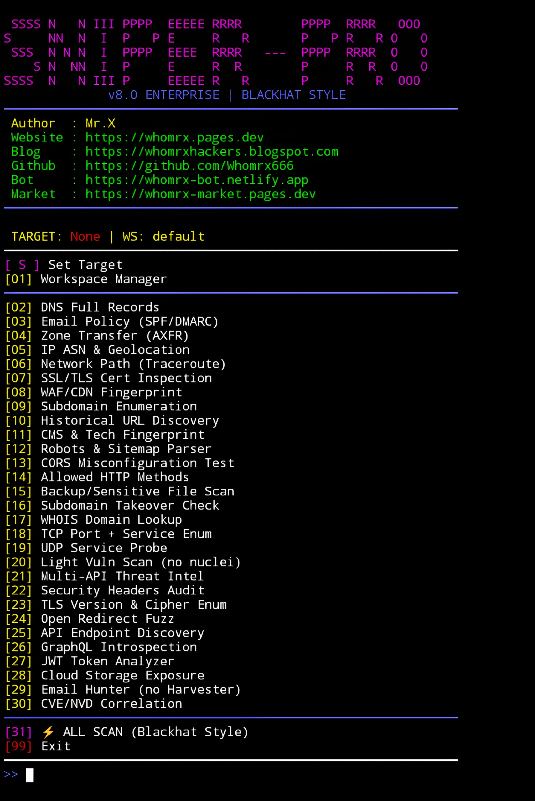

# Sniper Pro


<p align="center">
  <strong>Blackhat Recon Engine · 30+ Deep Scan Modules</strong><br>
  <em>"Know your enemy, know yourself" – Mr.X</em>
</p>

## Introduction
Sniper Pro is a powerful, all-in-one reconnaissance and vulnerability assessment framework designed for **red team operations** and **authorized security testing**. Built with a sleek REDHAWK-style interface, it packs **30+ integrated deep-scan modules** that automate everything from basic DNS intelligence to advanced threat correlation. The engine is fully **Termux-compatible (Android)**, runs flawlessly on Linux and Windows, and requires **no root access**.

## Installation
```bash
$ pkg update -y && pkg upgrade -y
$ pkg install git python -y
$ git clone https://github.com/Whomrx666/sniper-pro.git
$ cd sniper-pro
$ python3 install.py

```
## Run manually
```
$ python3 sniper-pro.py
```

## Features
- **30+ Deep Scan Modules** – DNS, SSL, WAF, subdomains, CVE correlation, and more.
- **Termux Optimized** – Works out of the box on Android (no root).
- **RedHawk Style UI** – Neon colors, animated loading screen, and a cinematic exit greeting.
- **Database Backend** – SQLite storage for scan history and workspace management.
- **Auto Report Generation** – Export full scan results in HTML format.
- **Self-Contained** – No Nuclei, no theHarvester, no paid APIs required for core operations.
- **Fallback Mechanisms** – Gracefully handles missing tools and uses pure-Python alternatives.
- **Threat Intelligence** – URLhaus, Spamhaus DBL lookups with zero API keys.
- **Email Discovery** – Hunter.io API support + Google Dork fallback.

## Instructions
- **First**: Install the tool using the commands above.
- **Second**: Run python3 sniper-pro.py – you will see the loading screen.
- **Third**: Set a target by pressing S and entering a domain or IP.
- **Fourth**: Choose any individual module (02–30) or execute a full deep scan with 31.
- **Last**: At the end, you can save an HTML report to the reports/ folder.

## Observation
This tool is intended for **educational and ethical hacking purposes only**. Unauthorized scanning of systems you do not own or have explicit permission to test is illegal. The author assumes no responsibility for misuse or damage caused by this tool.

### Original Author
<a href="https://github.com/Whomrx666"></a>

### <<< If you copy , Then Give me The Credits >>>

## CONNECT WITH ME :

[](https://whomrxhackers.blogspot.com/)
[](https://twitter.com/whomrx666)
[](https://wa.me/6285926601133?text=Halo%2C%20Mr.X)
[](https://www.facebook.com/whomrx.666)
[](https://t.me/Whomr_X)
[](mailto:whomrx666@gmail.com)
[](https://www.tiktok.com/@whomr.x)

**If you want to donate, click on the button**
<a href="https://saweria.co/whomrx"></a>

---

<p align="left">
  
</p>